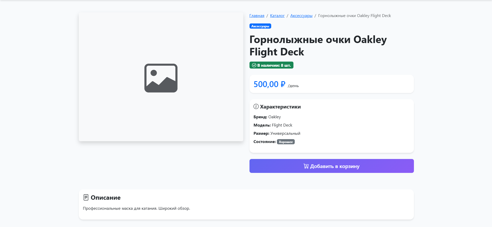
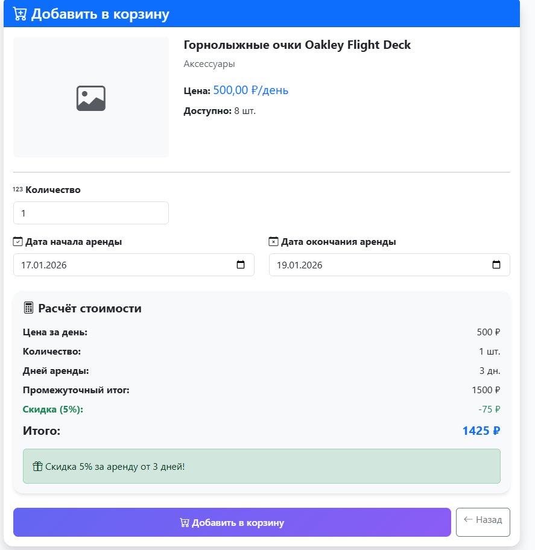
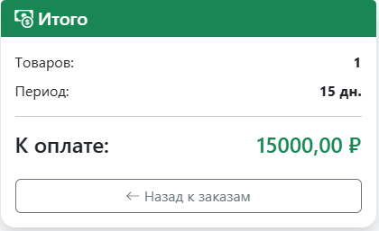

# РУКОВОДСТВО ПОЛЬЗОВАТЕЛЯ
## Система аренды спортивного инвентаря

**Версия системы:** 2.0  
**Дата:** 24.01.2026

---

## СОДЕРЖАНИЕ

1. [Введение](#введение)
2. [Начало работы](#начало-работы)
3. [Регистрация и авторизация](#регистрация-и-авторизация)
4. [Просмотр каталога](#просмотр-каталога)
5. [Поиск и фильтрация](#поиск-и-фильтрация)
6. [Добавление в корзину](#добавление-в-корзину)
7. [Оформление заказа](#оформление-заказа)
8. [Управление профилем](#управление-профилем)
9. [Мои заказы](#мои-заказы)
10. [Часто задаваемые вопросы](#часто-задаваемые-вопросы)

---

## ВВЕДЕНИЕ

### Назначение программы

Система аренды спортивного инвентаря - это веб-приложение для удобной аренды спортивного оборудования: лыж, сноубордов, коньков и аксессуаров.

### Основные возможности

- 🔍 Просмотр каталога инвентаря
- 🎯 Поиск и фильтрация товаров
- 🛒 Добавление товаров в корзину
- 💰 Автоматический расчет стоимости со скидками
- 📦 Оформление заказов онлайн
- 📊 Просмотр истории аренды
- ⭐ Написание отзывов

### Системные требования

**Для работы необходимо:**

- Современный веб-браузер:
  - Google Chrome 90+
  - Mozilla Firefox 88+
  - Microsoft Edge 90+
  - Safari 14+
- Стабильное интернет-соединение (рекомендуется 5 Мбит/с)
- Разрешение экрана от 1366×768 (поддерживаются мобильные устройства)

---

## НАЧАЛО РАБОТЫ

### Доступ к системе

1. Откройте веб-браузер
2. Перейдите по адресу: `http://localhost:8000/` (или адрес вашего сервера)
3. Вы увидите главную страницу системы

### Главная страница

На главной странице отображается:

- **Навигационное меню** (сверху)
- **Популярные категории** инвентаря
- **Преимущества** системы
- **Призыв к действию** (регистрация/вход)

---

## РЕГИСТРАЦИЯ И АВТОРИЗАЦИЯ

### Регистрация нового пользователя

**Шаг 1:** Нажмите кнопку **"Регистрация"** в правом верхнем углу

**Шаг 2:** Заполните форму регистрации:

| Поле | Описание | Обязательно |
|------|----------|-------------|
| Имя пользователя | Уникальное имя для входа | ✅ Да |
| Email | Ваш электронный адрес | ✅ Да |
| Имя | Ваше имя | ✅ Да |
| Фамилия | Ваша фамилия | ✅ Да |
| Телефон | Контактный телефон | ❌ Нет |
| Пароль | Пароль для входа | ✅ Да |
| Подтверждение | Повторите пароль | ✅ Да |

**Требования к паролю:**

- ✅ От 4 до 16 символов
- ✅ Минимум одна заглавная буква
- ✅ Минимум одна цифра
- ❌ Без символов: * & { } | +

**Примеры:**
- ✅ Правильно: `Pass123`, `MyPass1`, `Test2024`
- ❌ Неправильно: `pass123` (нет заглавных), `Password` (нет цифр), `Pa1` (слишком короткий)

**Шаг 3:** Нажмите кнопку **"Зарегистрироваться"**

**Результат:**
- ✅ Вы автоматически войдете в систему
- ✅ Появится приветственное сообщение
- ✅ Вы будете перенаправлены на главную страницу

### Вход в систему

**Шаг 1:** Нажмите кнопку **"Вход"** в правом верхнем углу

**Шаг 2:** Введите:
- Имя пользователя (или email)
- Пароль

**Шаг 3:** Нажмите **"Войти"**

### Выход из системы

1. Нажмите на **ваше имя** в правом верхнем углу
2. Выберите **"Выход"** в выпадающем меню

---

## ПРОСМОТР КАТАЛОГА

### Переход в каталог

**Способ 1:** Нажмите **"Каталог"** в навигационном меню

**Способ 2:** На главной странице нажмите **"Смотреть каталог"**

**Способ 3:** Выберите категорию на главной странице

### Карточка товара

Каждая карточка содержит:

### Детальная страница товара

Нажмите **"Подробнее"** чтобы увидеть:

- Полное описание товара
- Характеристики (бренд, модель, размер, состояние)
- Доступное количество
- Кнопку **"Добавить в корзину"**
- Похожие товары

---

## ПОИСК И ФИЛЬТРАЦИЯ

### Поиск товаров

**Шаг 1:** В левой панели каталога найдите поле **"Поиск"**

**Шаг 2:** Введите запрос (например: "лыжи", "Burton", "горные")

**Шаг 3:** Нажмите **"Применить"**

**Результат:** Отобразятся только товары, соответствующие запросу

### Фильтрация

#### Фильтр по категории

- Выберите категорию из выпадающего списка:
  - Горные лыжи
  - Сноуборды
  - Коньки
  - Санки и тюбинги
  - Аксессуары

#### Фильтр по цене

- Введите **минимальную** цену (от)
- Введите **максимальную** цену (до)
- Нажмите **"Применить"**

**Пример:** От `500` до `1500` покажет товары от 500₽ до 1500₽ за день

#### Фильтр по состоянию

Выберите состояние:
- ⭐⭐⭐ Отличное
- ⭐⭐ Хорошее
- ⭐ Удовлетворительное

#### Фильтр по доступности

- **В наличии** - только доступные товары
- **Нет в наличии** - недоступные товары
- **Все** - показать все

### Сортировка

В правой части над товарами выберите:

- **Сначала новые** (по умолчанию)
- **Сначала старые**
- **Цена: по возрастанию** (от дешевых к дорогим)
- **Цена: по убыванию** (от дорогих к дешевым)
- **Название: А-Я**
- **Название: Я-А**

### Сброс фильтров

Нажмите кнопку **"Сбросить"** чтобы очистить все фильтры

---

## ДОБАВЛЕНИЕ В КОРЗИНУ

### Процесс добавления

**Шаг 1:** Выберите товар и нажмите **"Добавить в корзину"**

**Шаг 2:** На странице добавления укажите:

#### Количество
- Выберите количество единиц товара
- Не может превышать доступное количество

#### Даты аренды

**Дата начала:**
- Выберите дату начала аренды
- Не может быть в прошлом
- По умолчанию: завтра

**Дата окончания:**
- Выберите дату окончания
- Должна быть позже даты начала
- По умолчанию: через 3 дня от начала

### Калькулятор стоимости 💰

**Автоматический расчет:**

Система автоматически рассчитывает стоимость при изменении параметров:

**Система скидок:**

- 🎁 **5% скидка** при аренде от 3 дней
- 🎁 **10% скидка** при аренде от 7 дней

**Примеры:**

**Пример 1: Без скидки**
- Товар: Коньки (500 ₽/день)
- Количество: 1 шт.
- Период: 2 дня
- Расчет: 500 × 1 × 2 = **1000 ₽**

**Пример 2: Скидка 5%**
- Товар: Лыжи (1500 ₽/день)
- Количество: 1 шт.
- Период: 5 дней
- Расчет: 
  - База: 1500 × 1 × 5 = 7500 ₽
  - Скидка: 7500 × 5% = 375 ₽
  - **Итого: 7125 ₽**

**Пример 3: Скидка 10%**
- Товар: Сноуборд (1600 ₽/день)
- Количество: 2 шт.
- Период: 10 дней
- Расчет:
  - База: 1600 × 2 × 10 = 32000 ₽
  - Скидка: 32000 × 10% = 3200 ₽
  - **Итого: 28800 ₽**

**Шаг 3:** Нажмите **"Добавить в корзину"**

**Результат:**
- ✅ Товар добавлен в корзину
- ✅ Появится сообщение об успехе
- ✅ Вы будете перенаправлены в корзину

---

## КОРЗИНА

### Просмотр корзины

**Способ 1:** После добавления товара вы автоматически попадете в корзину

**Способ 2:** Нажмите **"Корзина"** в навигационном меню

### Управление корзиной

#### Изменение количества

1. В поле **"Количество"** введите новое значение
2. Система автоматически пересчитает стоимость (AJAX)
3. Обновится общая сумма

**Особенности:**
- Обновление происходит без перезагрузки страницы
- Мгновенный пересчет всех сумм
- Проверка доступного количества

#### Удаление товара

1. Нажмите кнопку **🗑️ Удалить** рядом с товаром
2. Подтвердите удаление
3. Товар будет удален из корзины

### Информация в корзине

Для каждого товара отображается:

- Изображение
- Название и категория
- Цена за день
- Даты аренды (с какого по какое число)
- Количество дней
- Количество единиц
- Подытог (стоимость этой позиции)
- Кнопка удаления

**Итоговая панель справа:**

---

## ОФОРМЛЕНИЕ ЗАКАЗА

### Процесс оформления

**Шаг 1:** В корзине нажмите **"Оформить заказ"**

**Шаг 2:** Проверьте информацию о заказе:

- Список всех товаров
- Даты аренды
- Количество и стоимость каждой позиции
- Общую сумму

**Шаг 3:** (Опционально) Добавьте комментарий:

Например:
- "Прошу подготовить инвентарь к 10:00"
- "Нужна помощь с настройкой креплений"
- "Доставка по адресу: ул. Ленина, 10"

**Шаг 4:** Нажмите **"Подтвердить заказ"**

### Что происходит после оформления?

1. ✅ Создается заказ со статусом **"Ожидает подтверждения"**
2. ✅ Товары переносятся из корзины в заказ
3. ✅ Уменьшается доступное количество инвентаря
4. ✅ Корзина очищается
5. ✅ Вы получаете номер заказа
6. ✅ Отображается страница заказа

### Статусы заказа

| Статус | Описание | Что делать |
|--------|----------|------------|
| ⏳ Ожидает подтверждения | Заказ создан, ожидает обработки менеджером | Ждите подтверждения |
| ✅ Подтвержден | Менеджер подтвердил заказ | Подготовьтесь к получению |
| 🟢 Активная аренда | Вы получили инвентарь | Пользуйтесь инвентарем |
| ✔️ Завершен | Инвентарь возвращен | Можете оставить отзыв |
| ❌ Отменен | Заказ отменен | - |

---

## МОИ ЗАКАЗЫ

### Просмотр истории заказов

**Шаг 1:** Нажмите **"Мои заказы"** в навигационном меню

**Шаг 2:** Вы увидите список всех ваших заказов

### Информация о заказе

Для каждого заказа отображается:

- 🔢 **Номер заказа**
- 📅 **Дата создания**
- 📆 **Период аренды** (с - по)
- 📊 **Статус** (цветной бейдж)
- 📦 **Количество товаров**
- 💰 **Общая сумма**
- 👁️ **Кнопка просмотра**

### Детальный просмотр заказа

**Шаг 1:** Нажмите кнопку **👁️** рядом с заказом

**Шаг 2:** Вы увидите полную информацию:

**Раздел "Информация о заказе":**
- Дата создания и обновления
- Период аренды
- Количество дней
- Кто подтвердил (если подтвержден)
- Ваш комментарий (если был)

**Раздел "Товары в заказе":**
- Список всех товаров
- Цена за день
- Количество
- Дней аренды
- Подытог для каждого товара

**Итоговая панель:**
- Общее количество товаров
- Общее количество дней
- Итоговая сумма к оплате

---

## УПРАВЛЕНИЕ ПРОФИЛЕМ

### Просмотр профиля

**Шаг 1:** Нажмите на **ваше имя** в правом верхнем углу

**Шаг 2:** Выберите **"Профиль"**

### Статистика профиля

В левой части отображается:

- 👤 Ваш аватар (если загружен)
- 📛 Ваше полное имя
- 🏷️ Ваша роль
- 📊 **Статистика:**
  - Всего аренд
  - Активных аренд
  - Завершенных аренд

### Редактирование профиля

В правой части находится форма:

**Можно изменить:**
- Имя и Фамилию
- Email
- Телефон
- Адрес
- Дату рождения
- Аватар

**Шаг 1:** Внесите изменения в нужные поля

**Шаг 2:** Нажмите **"Сохранить изменения"**

**Результат:**
- ✅ Данные обновлены
- ✅ Появится сообщение об успехе

**Примечание:** Имя пользователя (username) изменить нельзя!

---

## ЧАСТО ЗАДАВАЕМЫЕ ВОПРОСЫ

### Общие вопросы

**Q: Нужно ли регистрироваться для просмотра каталога?**  
A: Нет, каталог доступен всем. Регистрация нужна только для аренды.

**Q: Могу ли я изменить пароль?**  
A: Да, в профиле есть возможность смены пароля.

**Q: Как узнать, когда подтвердят мой заказ?**  
A: Статус заказа можно проверить в разделе "Мои заказы".

### Аренда и заказы

**Q: Можно ли отменить заказ?**  
A: Да, обратитесь к менеджеру или администратору.

**Q: Как рассчитывается стоимость?**  
A: Стоимость = Цена за день × Количество × Дни - Скидка  
Скидки: 5% от 3 дней, 10% от 7 дней.

**Q: Что делать, если нужного товара нет в наличии?**  
A: Свяжитесь с менеджером - возможно товар появится позже.

**Q: Можно ли арендовать на один день?**  
A: Да, минимальный срок - 1 день.

**Q: Как добавить несколько разных товаров?**  
A: Добавляйте товары по одному, они накопятся в корзине.

### Корзина

**Q: Сколько товаров можно добавить в корзину?**  
A: Неограниченное количество (в пределах доступности).

**Q: Сохраняется ли корзина после выхода?**  
A: Да, корзина привязана к вашему аккаунту.

**Q: Можно ли изменить даты в корзине?**  
A: Нет, нужно удалить товар и добавить заново с новыми датами.

### Технические вопросы

**Q: Почему не работает кнопка?**  
A: Проверьте интернет-соединение и обновите страницу (F5).

**Q: Система не пускает меня в аккаунт**  
A: Проверьте правильность ввода логина и пароля.

**Q: Забыл пароль, что делать?**  
A: Обратитесь к администратору для восстановления.

---

## КОНТАКТЫ ПОДДЕРЖКИ

**Техническая поддержка:**
- 📧 Email: support@sportarenda.ru
- 📞 Телефон: +7 (999) 123-45-67
- ⏰ Режим работы: Пн-Пт 9:00-18:00

**Менеджеры:**
- 📞 Телефон: +7 (999) 123-45-68
- ⏰ Режим работы: Ежедневно 8:00-20:00

---

## ПОЛЕЗНЫЕ СОВЕТЫ

### 💡 Советы по использованию

1. **Планируйте заранее** - оформляйте заказ за несколько дней
2. **Используйте фильтры** - так быстрее найдете нужное
3. **Проверяйте скидки** - арендуйте на неделю и получите 10% скидку
4. **Читайте описания** - там указаны все характеристики
5. **Оставляйте отзывы** - помогите другим клиентам

### ⚠️ Частые ошибки

❌ **Ошибка:** Выбрал дату начала в прошлом  
✅ **Решение:** Дата должна быть сегодня или позже

❌ **Ошибка:** Дата окончания раньше даты начала  
✅ **Решение:** Окончание должно быть позже начала

❌ **Ошибка:** Пытаюсь арендовать больше чем доступно  
✅ **Решение:** Проверьте доступное количество

❌ **Ошибка:** Пароль не соответствует требованиям  
✅ **Решение:** Используйте заглавные буквы и цифры

---

**Версия документа:** 2.0  
**Дата обновления:** 24.01.2026  
**Разработчик:** [Ваше ФИО]